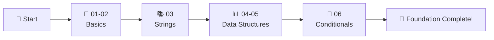

# ✅ Complete Python - IN PROGRESS! 🐍

<div align="center">


### 🐍 Complete Python Programming Course

**From Basics to Advanced - Learn Python Step by Step**

[⭐ Star this Repo](https://github.com/ranichandnirani/Complete-Python) • [🍴 Fork It](https://github.com/ranichandnirani/Complete-Python/fork) • [📝 Report Issue](https://github.com/ranichandnirani/Complete-Python/issues)

</div>

---

## 📌 About This Repository

This repository documents my Python learning journey through the CodeWithHarry Python course. It includes structured notes, hands-on examples, and practice exercises covering core concepts from fundamentals to advanced topics. The content is organized for clarity and practical understanding.

**Perfect for:**

- 🎯 Learning Python from absolute scratch
- 📚 Building strong programming fundamentals
- 💡 Understanding Python data structures
- 🚀 Preparing for data science and automation
- 📖 Quick reference and revision

---

## 🎯 Course Content Overview

### 🔰 Fundamentals

| Module  | Topic                        | Content                      | Status |
| ------- | ---------------------------- | ---------------------------- | ------ |
| **01** | Introduction to Python        | Setup, First Program, Basics | ✅     |
| **02** | Variables & Data Types        | Variables, Types, Casting    | ✅     |
| **03** | Strings                       | String Methods, Formatting   | ✅     |

### 📊 Data Structures

| Module  | Topic                        | Content                      | Status |
| ------- | ---------------------------- | ---------------------------- | ------ |
| **04** | Lists & Tuples                | Lists, Tuples, Methods       | ✅     |
| **05** | Dictionary & Sets             | Dict, Sets, Operations       | ✅     |

### 🔀 Control Flow

| Module  | Topic                        | Content                      | Status |
| ------- | ---------------------------- | ---------------------------- | ------ |
| **06** | Conditional Expressions       | if-else, elif, Ternary       | ✅     |

---

## 🚀 Quick Start

### Prerequisites

```bash
✅ Python 3.8 or higher
✅ Code Editor (VS Code, PyCharm, or any IDE)
✅ Basic computer knowledge
✅ Enthusiasm to learn!
```

### Installation & Usage

```bash
# Clone the repository
git clone https://github.com/ranichandnirani/Complete-Python.git

# Navigate to the folder
cd Complete-Python

# Choose any module (example: 02 Variables & Datatypes)
cd "02 Variables & Datatypes"

# Run Python file
python filename.py
```

### Python Installation

**Windows:**
```bash
# Download from python.org
# Or use Microsoft Store
```

**Mac:**
```bash
brew install python3
```

**Linux:**
```bash
sudo apt-get install python3
```

**Verify Installation:**
```bash
python --version
# or
python3 --version
```

---

## 📂 Repository Structure

```
📦 Complete Python
├── 📁 01 Intro-python
│   └── Introduction & Setup
├── 📁 02 Variables & Datatypes
│   └── Variables, Data Types, Type Conversion
├── 📁 03 Strings
│   └── String Operations & Methods
├── 📁 04 Lists & Tuples
│   └── Lists, Tuples, List Comprehension
├── 📁 05 Dictionary & Sets
│   └── Dictionaries, Sets, Operations
├── 📁 06 Conditional Expression
│   └── if-else, elif, Nested conditions
└── 📄 README.md (This file)
```

---

## 💡 Key Learning Highlights

### 🎯 What's Covered

✨ **Python Basics**

- Python Installation & Setup
- Variables & Data Types
- Type Conversion & Casting
- Input/Output Operations
- Comments & Documentation

🔥 **Data Structures**

- Strings (Methods, Slicing, Formatting)
- Lists (Creation, Methods, Slicing, Comprehension)
- Tuples (Immutable sequences)
- Dictionaries (Key-Value pairs, Methods)
- Sets (Unique elements, Set operations)

🏆 **Control Flow**

- Conditional Statements (if, elif, else)
- Comparison Operators
- Logical Operators
- Nested Conditions
- Ternary Operators

🚀 **What's Next**

- More modules coming soon!
- Focus on mastering current concepts
- Practice with exercises
- Build small projects with learned concepts

---

## 🎓 Learning Path



---

## 📖 Detailed Modules

<details>
<summary>🐍 <b>Module 01: Introduction to Python</b></summary>

**Topics Covered:**
- What is Python?
- Why learn Python?
- Python installation
- First Python program
- Python syntax basics
- Print function
- Comments

**Key Learnings:**
- Setting up Python environment
- Understanding Python philosophy
- Writing your first program
</details>

<details>
<summary>📦 <b>Module 02: Variables & Data Types</b></summary>

**Topics Covered:**
- Variables & naming conventions
- Data types (int, float, str, bool)
- Type conversion
- Type casting
- Multiple assignment
- Constants

**Key Learnings:**
- Variable declaration
- Understanding Python data types
- Dynamic typing in Python
</details>

<details>
<summary>📝 <b>Module 03: Strings</b></summary>

**Topics Covered:**
- String creation
- String indexing & slicing
- String methods (upper, lower, strip, etc.)
- String formatting (f-strings, format())
- String concatenation
- Escape characters

**Key Learnings:**
- String manipulation techniques
- Formatting output
- Working with text data
</details>

<details>
<summary>📋 <b>Module 04: Lists & Tuples</b></summary>

**Topics Covered:**
- List creation & operations
- List methods (append, insert, remove, etc.)
- List slicing & indexing
- List comprehension
- Tuples (creation, immutability)
- Tuple packing & unpacking

**Key Learnings:**
- Working with ordered collections
- List vs Tuple differences
- Efficient list operations
</details>

<details>
<summary>🗂️ <b>Module 05: Dictionary & Sets</b></summary>

**Topics Covered:**
- Dictionary creation
- Accessing & modifying dictionaries
- Dictionary methods (keys, values, items)
- Dictionary comprehension
- Sets (creation, operations)
- Set methods (union, intersection, difference)

**Key Learnings:**
- Key-value pair data structures
- Unique element collections
- Dictionary and set operations
</details>

<details>
<summary>🔀 <b>Module 06: Conditional Expressions</b></summary>

**Topics Covered:**
- if statement
- if-else statement
- elif (else if)
- Nested conditions
- Ternary operator
- Logical operators (and, or, not)
- Comparison operators

**Key Learnings:**
- Decision making in Python
- Complex conditional logic
- Short-circuit evaluation
</details>

---

## 🤝 Contributing

Contributions are welcome! Here's how you can help:

1. 🍴 Fork the repository
2. 🌿 Create a feature branch (`git checkout -b feature/NewTopic`)
3. ✍️ Commit your changes (`git commit -m 'Add new topic'`)
4. 📤 Push to the branch (`git push origin feature/NewTopic`)
5. 🔃 Open a Pull Request

**Contribution Ideas:**

- 🐛 Fix bugs or typos
- ✨ Add more examples
- 📝 Improve documentation
- 💡 Add practice exercises
- 🎯 Add module explanations

---

## 📚 Useful Resources

### Official Documentation

- [🐍 Python Official Docs](https://docs.python.org/3/)
- [📖 Python Tutorial](https://docs.python.org/3/tutorial/)
- [📚 Python Standard Library](https://docs.python.org/3/library/)

### Learning Platforms

- [💻 Real Python](https://realpython.com/)
- [📚 W3Schools Python](https://www.w3schools.com/python/)
- [🎓 Python.org Beginner's Guide](https://wiki.python.org/moin/BeginnersGuide)
- [📖 Learn Python](https://www.learnpython.org/)

### Practice Coding

- [🎯 LeetCode](https://leetcode.com/)
- [💪 HackerRank Python](https://www.hackerrank.com/domains/python)
- [🏆 CodeWars](https://www.codewars.com/)
- [⚔️ Exercism Python Track](https://exercism.org/tracks/python)

### Video Tutorials

- [🎥 Corey Schafer](https://www.youtube.com/@coreyms)
- [📺 Programming with Mosh](https://www.youtube.com/@programmingwithmosh)
- [🎬 Tech With Tim](https://www.youtube.com/@TechWithTim)
- [📹 freeCodeCamp Python](https://www.youtube.com/@freecodecamp)

### Books (Free)

- [📕 Automate the Boring Stuff](https://automatetheboringstuff.com/)
- [📗 Python for Everybody](https://www.py4e.com/book)
- [📘 Think Python](https://greenteapress.com/wp/think-python-2e/)

---

## 🌟 Features

- ✅ **6 Modules Completed**: Strong foundation built
- ✅ **Hands-on Examples**: Practical code in every module
- ✅ **Well-Structured**: Organized learning path
- ✅ **Progressive Learning**: Step-by-step approach
- ✅ **Clean Code**: Well-commented examples
- ✅ **Beginner Friendly**: Start from absolute basics
- ✅ **100% Python**: Pure Python focus
- ✅ **More Coming**: Continuous updates

---

## 📊 Course Statistics

```
📚 Modules Completed: 6
💻 Topics Covered: 12+
🎯 Core Concepts: Basics, Strings, Data Structures, Conditionals
⏱️ Time Investment: 12-15 hours
🎓 Difficulty: Beginner
📝 Language: 100% Python
🚀 Status: Foundation Complete
```

---

## 🎯 Learning Outcomes

After completing these 6 modules, you will be able to:

✅ Set up Python development environment  
✅ Understand Python syntax and basics  
✅ Work with all major data types (int, float, str, bool)  
✅ Manipulate strings effectively  
✅ Use lists, tuples, dictionaries, and sets  
✅ Write conditional logic (if-else, elif)  
✅ Build strong Python fundamentals  
✅ Ready to learn loops, functions, and advanced topics  

---

## 📄 License

This project is licensed under the **MIT License** - feel free to use for learning and teaching!

[](LICENSE)

---

## 🌟 Show Your Support

If this repository helped you learn Python:

⭐ **Star** this repository  
🍴 **Fork** for your reference  
📢 **Share** with fellow learners  
🤝 **Contribute** to improve it  

---

## 🔗 Connect With Me

<div align="center">

[](https://github.com/ranichandnirani)
</div>

---

## 💬 Support

Need help or have questions?

- 💡 [Open an Issue](https://github.com/ranichandnirani/Complete-Python/issues)
- 📧 Email: chandnirani229@gmail.com
- 🌐 GitHub: [@ranichandnirani](https://github.com/ranichandnirani)

---

<div align="center">

### 🎉 Foundation Complete - 6 Modules Done! 🎉

**Made with ❤️ and ☕ by Chandni Rani**

_Python Fundamentals Mastered!_ 🐍✨

---


**⭐ If this helped you, please star this repository! ⭐**

</div>