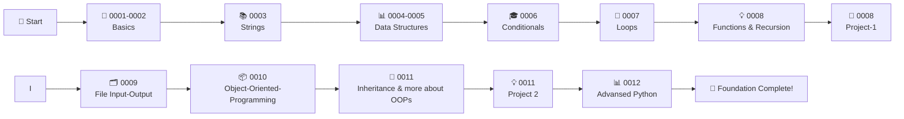

# ✅ Complete Python - IN PROGRESS! 🐍

<div align="center">


### 🐍 Complete Python Programming Course

**From Basics to Advanced - Learn Python Step by Step**

[⭐ Star this Repo](https://github.com/ranichandnirani/Complete-Python) • [🍴 Fork It](https://github.com/ranichandnirani/Complete-Python/fork) • [📝 Report Issue](https://github.com/ranichandnirani/Complete-Python/issues)

</div>

---

## 📌 About This Repository

This repository documents my Python learning journey through the CodeWithHarry Python course. It includes structured notes, hands-on examples, and practice exercises covering core concepts from fundamentals to advanced topics. The content is organized for clarity and practical understanding.

**Perfect for:**

- 🎯 Learning Python from absolute scratch
- 📚 Building strong programming fundamentals
- 💡 Understanding Python data structures
- 🚀 Preparing for data science and automation
- 📖 Quick reference and revision

---

## 🎯 Course Content Overview

### 🔰 Fundamentals

| Module   | Topic                          | Content                      | Status           |
| -------  | ------------------------------ | ---------------------------- | ------           |
| **0001** | Introduction to Python         | Setup, First Program, Basics | ✅ Completed    |
| **0002** | Variables & Data Types         | Variables, Types, Casting    | ✅ Completed    |
| **0003** | Strings                        | String Methods, Formatting   | ✅ Completed    |

### 📊 Data Structures

| Module   | Topic                         | Content                      | Status           |
| -------  | ----------------------------  | ---------------------------  | ---------------  |
| **0004** | Lists & Tuples                | Lists, Tuples, Methods       | ✅ Completed     |
| **0005** | Dictionary & Sets             | Dict, Sets, Operations       | ✅ Completed     |

### 🔀 Control Flow

| Module   | Topic                         | Content                      | Status             |
| -------  | ----------------------------  | ---------------------------- | ------             |
| **0006** | Conditional Expressions       | if-else, elif, Ternary       | ✅ Completed       |
| **0007** | Loops                         | for, while, break, continue  | ✅ Completed       |

### 🎯 Functions & Recursions

| Module   | Topic                         | Content                      | Status             |
| -------  | ----------------------------  | ---------------------------- | ------             |
| **0008** | Functions & Recursions       | Type of argument, local and global variables, Recursion     | ✅ Completed       |
| **0008** | Project-1                    | SNAKE, WATER, GUN GAME     | ✅ Completed       |
| **0009** | File I/O       | r – open for reading, w - open for writing, a - open for appending, + - open for updating, ‘rb’ will open for read in binary mode, ‘rt’ will open for read in text mode.     | ✅ Completed       |
| **0010** | Object-Oriented Programming       | Classes & Objects, self, constructor     | ✅ Completed       |
| **0011** | Inheritance       | Single, Multiple, Multilevel,  Hierarichical, Hybride    | ✅ Completed       |
| **0011** | Project-2       | Generates a random   | ✅ Completed       |
---

## 🚀 Quick Start

### Prerequisites

```bash
✅ Python 3.8 or higher
✅ Code Editor (VS Code, PyCharm, or any IDE)
✅ Basic computer knowledge
✅ Enthusiasm to learn!
```

### Installation & Usage

```bash
# Clone the repository
git clone https://github.com/ranichandnirani/Complete-Python.git

# Navigate to the folder
cd Complete-Python

# Choose any module (example: 0002 Variables & Datatypes)
cd "0002 Variables & Datatypes"

# Run Python file
python filename.py
```

### Python Installation

**Windows:**
```bash
# Download from python.org
# Or use Microsoft Store
```

**Mac:**
```bash
brew install python3
```

**Linux:**
```bash
sudo apt-get install python3
```

**Verify Installation:**
```bash
python --version
# or
python3 --version
```

---

## 📂 Repository Structure

```
📦 Complete Python
├── 📁 0001 Intro-python
│   └── Introduction & Setup
├── 📁 0002 Variables & Datatypes
│   └── Variables, Data Types, Type Conversion
├── 📁 0003 Strings
│   └── String Operations & Methods
├── 📁 0004 Lists & Tuples
│   └── Lists, Tuples, List Comprehension
├── 📁 0005 Dictionary & Sets
│   └── Dictionaries, Sets, Operations
├── 📁 0006 Conditional Expression
│   └── if-else, elif, Nested conditions
├── 📁 0007 Loops 
│   └── for, while, break, continue
├── 📁 0008 Functions and Recursion 
│   └── Type of arguments, local and global variable, Recursion
├── 📁 0008 Project-1 
│   └── SNAKE, WATER, GUN GAME
├── 📁 0009 File Handling
│   └── File I/O, read and write, open and close, and append
├── 📁 0010-0011 Object-Oriented-Programming 
│   └── Classes and Objects, Inheritance, Encapsulation, Polymorphysom, Abstraction
├── 📁 0011 Project-2 Random number Guessing 
│   └── Using Random module
└── 📄 README.md (This file)

```

---

## 💡 Key Learning Highlights

### 🎯 What's Covered

✨ **Python Basics**

- Python Installation & Setup
- Variables & Data Types
- Type Conversion & Casting
- Input/Output Operations
- Comments & Documentation

🔥 **Data Structures**

- Strings (Methods, Slicing, Formatting)
- Lists (Creation, Methods, Slicing, Comprehension)
- Tuples (Immutable sequences)
- Dictionaries (Key-Value pairs, Methods)
- Sets (Unique elements, Set operations)

🏆 **Control Flow**

- **Conditional Statements** (if, elif, else)
-  **Loops** ()
-  for loops
-  while loops
-  break statement
-  continue statement
-  Nested loops
-  Loop with else
-  Range function

🎯 **Functions & Recursions**

- Types of functions
- Types of arguments
- Local and Global variable
- Recursion

🚀 **What's Next**

- More modules coming soon!
- Focus on mastering current concepts
- Practice with exercises
- Build small projects with learned concepts

---

## 🎓 Learning Path


```mermaid
graph LR
    A[🌱 Start] --> B[📝 0001-0002<br/>Basics]
    B --> C[📚 0003<br/>Strings]
    C --> D[📊 0004-0005<br/>Data Structures]
    D --> E[🎓 0006<br/>Conditionals]
    E --> F[📖 0007<br/>Loops]
    F --> G[💡 0008<br/>Functions & Recursion]
    G --> H[🚀 0008<br/>Project-1]
    I --> J[🗂️ 0009<br/>File Input-Output]
    J --> K[📦 0010<br/>Object-Oriented-Programming]
    K --> L[📝 0011<br/>Inheritance & more about OOPs]
    L --> M[💡 0011<br/>Project 2]
    M --> N[📊 0012<br/>Advansed Python]
    N --> O[🎉 Foundation Complete!]
```

---

## 📖 Detailed Modules

<details>
<summary>🐍 <b>Module 0001: Introduction to Python</b></summary>

**Topics Covered:**
- What is Python?
- Why learn Python?
- Python installation
- First Python program
- Python syntax basics
- Print function
- Comments

**Key Learnings:**
- Setting up Python environment
- Understanding Python philosophy
- Writing your first program
</details>

<details>
<summary>📦 <b>Module 0002: Variables & Data Types</b></summary>

**Topics Covered:**
- Variables & naming conventions
- Data types (int, float, str, bool)
- Type conversion
- Type casting
- Multiple assignment
- Constants

**Key Learnings:**
- Variable declaration
- Understanding Python data types
- Dynamic typing in Python
</details>

<details>
<summary>📝 <b>Module 0003: Strings</b></summary>

**Topics Covered:**
- String creation
- String indexing & slicing
- String methods (upper, lower, strip, etc.)
- String formatting (f-strings, format())
- String concatenation
- Escape characters

**Key Learnings:**
- String manipulation techniques
- Formatting output
- Working with text data
</details>

<details>
<summary>📋 <b>Module 0004: Lists & Tuples</b></summary>

**Topics Covered:**
- List creation & operations
- List methods (append, insert, remove, etc.)
- List slicing & indexing
- List comprehension
- Tuples (creation, immutability)
- Tuple packing & unpacking

**Key Learnings:**
- Working with ordered collections
- List vs Tuple differences
- Efficient list operations
</details>

<details>
<summary>🗂️ <b>Module 0005: Dictionary & Sets</b></summary>

**Topics Covered:**
- Dictionary creation
- Accessing & modifying dictionaries
- Dictionary methods (keys, values, items)
- Dictionary comprehension
- Sets (creation, operations)
- Set methods (union, intersection, difference)

**Key Learnings:**
- Key-value pair data structures
- Unique element collections
- Dictionary and set operations
</details>

<details>
<summary>✅ <b>Module 0006: Conditional Expressions</b></summary>

**Topics Covered:**
- if statement
- if-else statement
- elif (else if)
- Nested conditions
- Ternary operator
- Logical operators (and, or, not)
- Comparison operators

**Key Learnings:**
- Decision making in Python
- Complex conditional logic
- Short-circuit evaluation
</details>

<details>
<summary>🔃 <b>Module 0007: Loops</b></summary>

**Topics to Cover:**
- for loops
- while loops
- break statement
- continue statement
- pass statement
- Nested loops
- Loop with else clause
- Range function
- Iterating over sequences

**Learning Goals:**
- Understanding iteration
- Loop control flow
- Efficient looping techniques
</details>

<details>
<summary>🎯 <b>Module 0008: Functions & Recursion</b></summary>

**Topics to Cover:**
- Types of functions
- Types of arguments
- Local and Global variable
- Recursion

**Learning Goals:**
- Understand why functions are used in Python
- Learn how to define and call functions
- Work with different types of arguments
- Understand the difference between local and global variables
- Learn how recursion works with a base case
- Solve simple problems using recursive functions

</details>

---

## 🤝 Contributing

Contributions are welcome! Here's how you can help:

1. 🍴 Fork the repository
2. 🌿 Create a feature branch (`git checkout -b feature/NewTopic`)
3. ✍️ Commit your changes (`git commit -m 'Add new topic'`)
4. 📤 Push to the branch (`git push origin feature/NewTopic`)
5. 🔃 Open a Pull Request

**Contribution Ideas:**

- 🐛 Fix bugs or typos
- ✨ Add more examples
- 📝 Improve documentation
- 💡 Add practice exercises
- 🎯 Add module explanations

---

## 📚 Useful Resources

### Official Documentation

- [🐍 Python Official Docs](https://docs.python.org/3/)
- [📖 Python Tutorial](https://docs.python.org/3/tutorial/)
- [📚 Python Standard Library](https://docs.python.org/3/library/)

### Learning Platforms

- [💻 Real Python](https://realpython.com/)
- [📚 W3Schools Python](https://www.w3schools.com/python/)
- [🎓 Python.org Beginner's Guide](https://wiki.python.org/moin/BeginnersGuide)
- [📖 Learn Python](https://www.learnpython.org/)

### Practice Coding

- [🎯 LeetCode](https://leetcode.com/)
- [💪 HackerRank Python](https://www.hackerrank.com/domains/python)
- [🏆 CodeWars](https://www.codewars.com/)
- [⚔️ Exercism Python Track](https://exercism.org/tracks/python)

### Video Tutorials

- [🎥 Corey Schafer](https://www.youtube.com/@coreyms)
- [📺 Programming with Mosh](https://www.youtube.com/@programmingwithmosh)
- [🎬 Tech With Tim](https://www.youtube.com/@TechWithTim)
- [📹 freeCodeCamp Python](https://www.youtube.com/@freecodecamp)

### Books (Free)

- [📕 Automate the Boring Stuff](https://automatetheboringstuff.com/)
- [📗 Python for Everybody](https://www.py4e.com/book)
- [📘 Think Python](https://greenteapress.com/wp/think-python-2e/)

---

## 🌟 Features

- ✅ **8 Modules Completed**: Strong foundation built
- ✅ **Hands-on Examples**: Practical code in every module
- ✅ **Well-Structured**: Organized learning path
- ✅ **Progressive Learning**: Step-by-step approach
- ✅ **Clean Code**: Well-commented examples
- ✅ **Beginner Friendly**: Start from absolute basics
- ✅ **100% Python**: Pure Python focus
- ✅ **More Coming**: Continuous updates

---

## 📊 Course Statistics

```
📚 Modules Completed: 6
💻 Topics Covered: 12+
🎯 Core Concepts: Basics, Strings, Data Structures, Conditionals
⏱️ Time Investment: 12-15 hours
🎓 Difficulty: Beginner
📝 Language: 100% Python
🚀 Status: Foundation Complete
```

---

## 🎯 Learning Outcomes

After completing these 6 modules, you will be able to:

✅ Set up Python development environment  
✅ Understand Python syntax and basics  
✅ Work with all major data types (int, float, str, bool)  
✅ Manipulate strings effectively  
✅ Use lists, tuples, dictionaries, and sets  
✅ Write conditional logic (if-else, elif)  
✅ Build strong Python fundamentals  
✅ Ready to learn loops, functions, and advanced topics  

---

## 🌟 Show Your Support

If this repository helped you learn Python:

⭐ **Star** this repository  
🍴 **Fork** for your reference  
📢 **Share** with fellow learners  
🤝 **Contribute** to improve it  

---

## 🔗 Connect With Me

<div align="center">

[](https://github.com/ranichandnirani)
[](https://www.linkedin.com/in/chandni-rani)
[](https://www.instagram.com/the_chan_dni/)
</div>

---

## 💬 Support

Need help or have questions?

- 💡 [Open an Issue](https://github.com/ranichandnirani/Complete-Python/issues)
- 📧 Email: chandnirani229@gmail.com
- 🌐 GitHub: [@ranichandnirani](https://github.com/ranichandnirani)
- 🚀 LinkedIn: [@chandni-rani](https://www.linkedin.com/in/chandni-rani)
- 🔗 Instagram: [@the_chan_dni](https://www.instagram.com/the_chan_dni/)
---

<div align="center">

### 🎉 Foundation Complete - 6 Modules Done! 🎉

**Made with ❤️ and ☕ by Chandni Rani**

_Python Fundamentals Mastered!_ 🐍✨

---


**⭐ If this helped you, please star this repository! ⭐**


</div>
